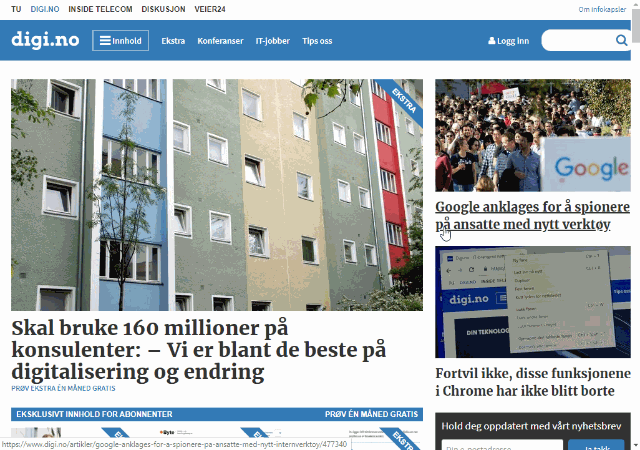

# Norwegian newspaper large images

Adds an element in your context menu to "Open large image", when right clicking an image on many Norwegian newspaper website.

Covered media groups or publishing platforms:

- [Aller Media (Labrador)](https://www.aller.no/node/2323)
- [Amedia](http://www.amedia.no/virksomheten/vare-mediehus/)
- [Polaris Media](http://www.polarismedia.no/vare-selskaper/)
- [Schibsted](https://schibsted.com/)
- [Teknisk Ukeblad Media (Neo)](https://www.tumedia.no/)
- [Newsflow](https://www.newsflow.no/)

Newspapers known to NOT be covered:

- VG
- E24
- Political newspapers

Released on [Chrome Web Store](https://chrome.google.com/webstore/detail/eohpfbapbmhblpjcnjfikpmcdkkpkihg) and [Firefox Add-ons](https://addons.mozilla.org/en-US/firefox/addon/nn-large-images/).

Functionality tested on 2019-10-29.

## Changelog

### 1.7.1

Added ITavisen support.

### 1.7

Added Newsflow support, but unknown exactly what domains to cover.
Added more domains to Aller Media (Labrador).
Improved the pattern used on Teknisk Ukeblad Media (Neo) domains.

### 1.6.1

Fixed broken URL patterns for Amedia newspapers.

### 1.6

Extended support to a lot of Norwegian newspapers.

### 1.5

Extension now gives a context menu option upon right clicking images on Polaris Media websites.

### < 1.5

These versions injected content scripts, but as Polaris Media kept changing up their DOM/scripts it didn't work well for long.

## License

The software in this repo is released under [CC-BY-SA 4.0](https://creativecommons.org/licenses/by-sa/4.0/), also found in the `LICENSE` file.

## Credits

The logo icon is the "tooltip-image" icon from [Material Design Icons](https://materialdesignicons.com/).
